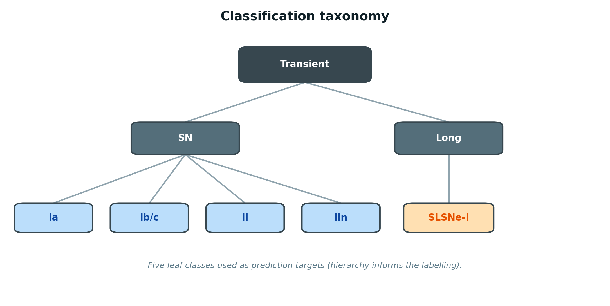
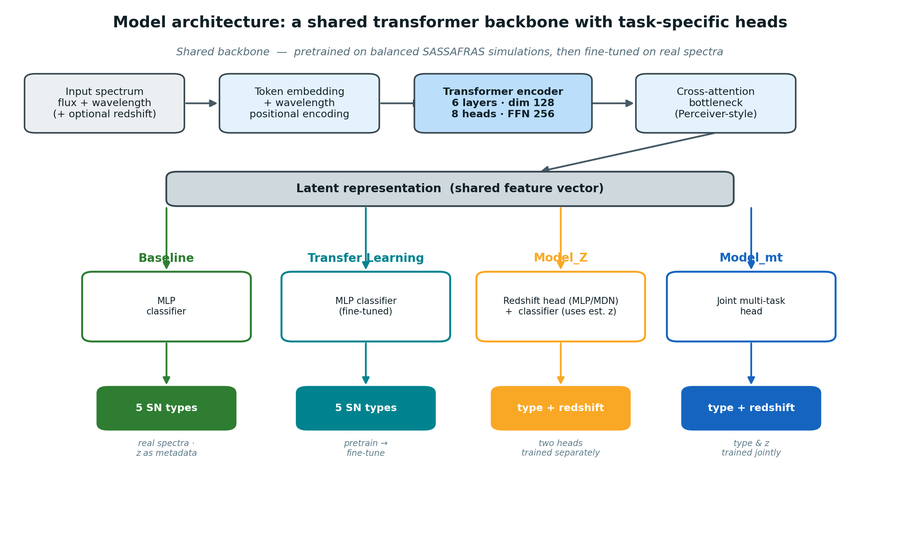
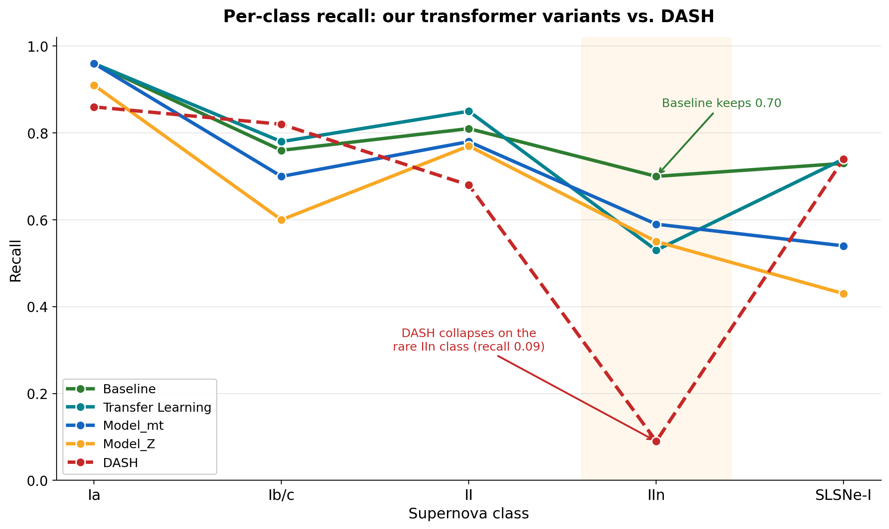
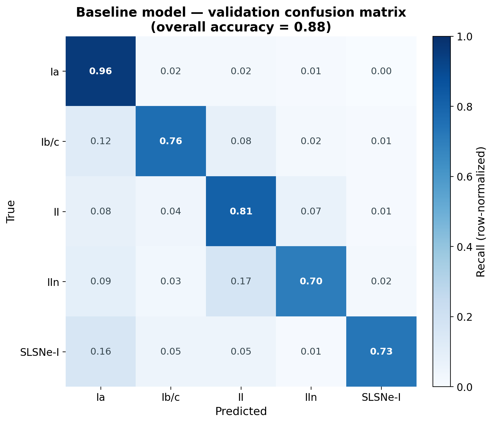
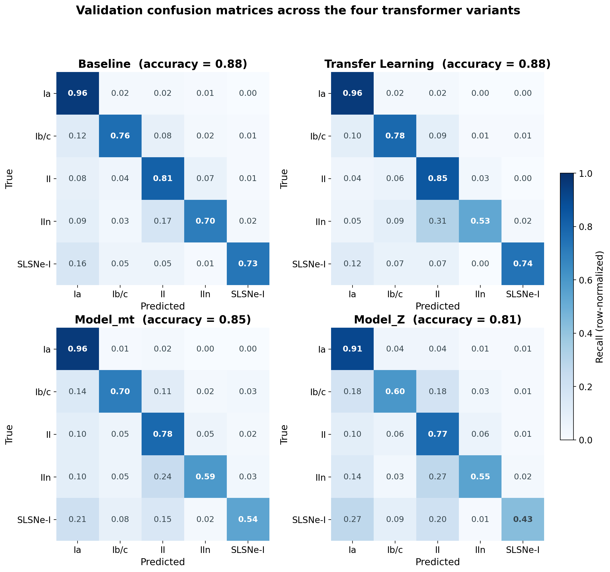

# Joint Classification and Redshift Estimation of Supernova Spectra with Transformers

> A transformer that reads a supernova spectrum directly and predicts **both** its physical type **and** its redshift — sharply improving on the widely‑used DASH classifier, especially for the rare supernova types that matter most to the science.

**TL;DR** — Next‑generation sky surveys will record far more supernova spectra than astronomers can ever label by hand. The standard automated tool for this, **DASH**, breaks down on rare supernova types and is sensitive to redshift and heavy preprocessing. I built a transformer that ingests a spectrum on its native wavelength grid (no de‑redshifting or resampling) and jointly predicts supernova type and redshift. It lifts recall on the rare **IIn** class from **0.09 (DASH) to 0.70**, while reaching **88% overall accuracy**. The work was accepted as a **poster at Open SkAI 2025**.

---

## The problem

When a massive star dies, it explodes as a **supernova**. The light from that explosion, spread out into a **spectrum** (brightness as a function of wavelength), carries the chemical and physical fingerprints of the event. Astronomers sort supernovae into a handful of physical **types** — Ia, Ib/c, II, IIn, and the superluminous SLSNe‑I — and each type tells a different story about how the star died. Type Ia supernovae are the "standard candles" used to measure the expansion of the Universe, and the spectrum also encodes **redshift**, which tells us how far away the explosion happened and how much the Universe has stretched since its light set out.

The catch is volume. Surveys such as the Vera C. Rubin Observatory's LSST will discover **millions** of transient events — orders of magnitude more than humans, or limited spectroscopic follow‑up, could ever classify by hand. Fast, reliable, automated classification of spectra — including the rare, faint, and scientifically precious types — is a genuine bottleneck for modern astronomy.

## Why existing methods fall short

Template‑matching tools (such as SNID) and the popular deep‑learning classifier **DASH** (Muthukrishna et al., 2019) demand heavily pre‑processed input: de‑redshifting, continuum removal, and resampling every spectrum onto a **fixed, evenly‑spaced wavelength grid**. I began this project by benchmarking DASH from scratch and documenting concrete failure modes:

- it **overfits the common classes and collapses on the rare ones** — recall on the IIn class drops to roughly **0.09**;
- its accuracy is **sensitive to redshift**, degrading on higher‑redshift spectra;
- it **cannot accept variable wavelength ranges or spacings**, so it can't generalise across instruments; and
- it tends to **misclassify noisy spectra into the Ic bucket**.

These weaknesses bite hardest exactly where the science is most valuable — the rare, faint, noisy, and high‑redshift events.

## My approach

I reframed the problem so a **single transformer** handles both tasks. A spectrum is treated as a sequence: the **flux** values are the tokens and the **wavelength** is encoded as position, so the model reads spectra on their native grid with **no de‑redshifting or resampling**. A redshift value can be supplied as metadata when it is available.

The **backbone** is a 6‑layer transformer encoder (model dimension 128, 8 attention heads) followed by a **Perceiver‑style cross‑attention bottleneck** that compresses a variable‑length spectrum into a compact latent representation. Lightweight heads sit on top: an MLP **classifier** and/or a **redshift regressor** — either an MLP, or a **Mixture Density Network** when calibrated uncertainty is wanted. Class imbalance is handled with **focal loss**.

I explored four variants to learn the best way to combine scarce real data with abundant simulations:

| Variant | Idea | Predicts |
|---|---|---|
| **Baseline** | Train directly on real Wiserep spectra, redshift as metadata | Type |
| **Transfer Learning** | Pretrain the backbone on balanced SASSAFRAS simulations, then fine‑tune on real data | Type |
| **Model_Z** | Separate redshift and classification heads; the classifier can consume an *estimated* redshift, so it still works when the true value is missing | Type + redshift |
| **Model_mt** | A single multi‑task head that predicts type and redshift **jointly** | Type + redshift |

Training data is ~4,800 real spectra plus class‑balanced simulations, augmented by oversampling each rare class to ~1,000 examples, adding white noise, random wavelength cropping, and random redshifting.

## Results

The headline is **per‑class recall**. Across every transformer variant, the largest gains land precisely on the classes DASH handles worst.

The most dramatic improvement is on the rare **IIn** class, where recall climbs from **0.09 (DASH) to 0.70 (Baseline)** — a class DASH effectively cannot recover. The transformer variants also hold strong recall on Ia (≥ 0.91) and improve the commonly‑confused II class, all **without** the de‑redshifting and fixed‑grid preprocessing that DASH requires.

The **Baseline** model reaches **88% overall validation accuracy** with a clean diagonal across all five types. **Transfer Learning** matches that 88% and edges ahead on the II class (0.85 recall), while **Model_mt** (0.85) and **Model_Z** (0.81) additionally output a redshift estimate — the multi‑task model tracks the true redshift closely across nearly two decades in *z*. All four variants are compared side by side below.

## My contributions

I designed and built this project end to end, and I am the **sole author and maintainer** of the codebase:

- **Designed the training pipeline** — data loaders for heterogeneous spectra, augmentation and minority oversampling, focal‑loss imbalance handling, and a fully config‑driven training/evaluation framework.
- **Implemented the transformer architecture** — the encoder backbone with a Perceiver‑style cross‑attention bottleneck, plus the classification and redshift heads (MLP and Mixture Density Network) in PyTorch.
- **Developed the four modelling strategies** — the baseline, the simulation‑pretraining transfer‑learning model, the separate‑heads Model_Z, and the joint multi‑task model.
- **Conducted the experiments** — including the from‑scratch benchmarking and failure analysis of DASH that motivated the whole redesign.
- **Analysed the results** — per‑class recall, confusion matrices, and redshift‑binned evaluation.

## Conference

An abstract based on this work was **accepted as a poster at the inaugural Open SkAI 2025 conference**, held at the SkAI Hub in Chicago, Illinois, USA, on September 2–5, 2025.

## Code & data

- **Code:** the full model code lives in the companion repository (folders `models/`, `models_z/`, `models_mt/`, and `configs/` for the best‑performing hyperparameters) — [github.com/YuqingYang-2238](https://github.com/YuqingYang-2238).
- **Processed data** (ready to train/validate): [Google Drive](https://drive.google.com/drive/folders/1kjsHkQVZ1SOoMGscvZc0JDy_e4d1h71C?usp=sharing).
- **Raw data:** available on request from the dataset maintainers (Amanda and Jennifer).

> Figures in this repository were generated from the model's own validation results. The recall‑by‑class comparison uses each model's per‑class validation recall; DASH is included as the prior state of the art.

## Author

**Yuqing Yang** — Northwestern University, Department of Statistics & Data Science
GitHub: [@YuqingYang-2238](https://github.com/YuqingYang-2238)

*Released under the MIT License (see `LICENSE`).*
